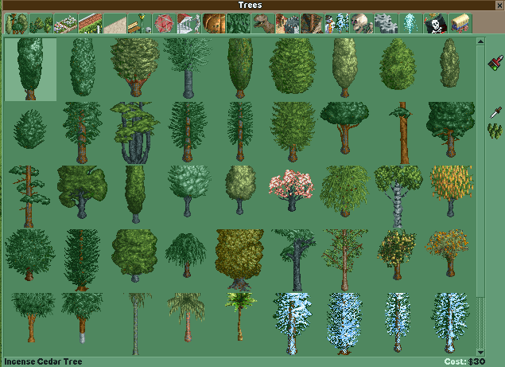

# OpenRCT2 Prometheus Exporter

An OpenRCT2 plugin that exports Prometheus metrics for a (limited but growing)
set of park metrics.

## Installation

This plugin requires the [OpenRCT2 networking API][networking-api], available on
the OpenRCT2 master branch, in preparation for OpenRCT2 v0.4.0.

Download [index.js](./index.js) from GitHub and save the file into your OpenRCT2
plugin folder. This location can be found according to the [OpenRCT2
scripting][scripting] documentation.

## Usage

The plugin runs in the background, listening for scripts at the address
"localhost:9751", which is currently hardcoded into the file, but may be
configurable soon.

### Metrics

The following metrics are available. Metric names and labels are subject to
change until version 1.0.0.

| metric        | type  | stability | labels |
| ------------- | ----- | --------- | ------ |
| park_cash     | gauge | unstable  | park   |
| park_rating   | gauge | unstable  | park   |
| park_bankLoan | gauge | unstable  | park   |
| guest_count   | gauge | unstable  | park   |
| staff_count   | gauge | unstable  | park   |
| peep_count    | gauge | unstable  | park   |
| duck_count    | gauge | unstable  | park   |

Yes, these metrics names are bad and don't follow the [naming best practices]. I
consider this to be a bug.

## Development

This plugin is maintained in a single file, [index.js](./index.js). While
unusal, this allows me to keep the number of dependencies to a minimium and
makes it easy for users to install into their copy of OpenRCT2. (This is
inspired by the reasoning behind the C [single-file libraries][sfl] list).

This plugin should be written to target EcmaScript 5 only, with no extensions.
The plugin environment in OpenRCT2 is not a modern browser nor Node.js
installation, and thus only ES5 is reliably available. This policy may change if
and when OpenRCT2 upgrades and enables later feature sets of Duktape.

This project uses specific versions and configurations of Prettier and ESLint
using [Nix]. Once installed, you'll be able to use these versions by running
`nix-shell`. You can also use a Docker container, similar to the GitHub Actions
configuration.

## Twitch Livestreams

You can catch me working on this, or other programming projects, as
[\@consolelog][twitch] on Twitch. Fill free to come by and ask questions!

## Donations

If you enjoy using this plugin, I ask that you plant some trees on
[Ecologi][ecologi] to help offset and reduce our carbon impact.

[networking-api]: https://github.com/OpenRCT2/OpenRCT2/blob/96d1db97e0bbc689ef9d5d48ee2514bec7c5c7f8/distribution/scripting.md#:~:text=Can%20plugins%20communicate%20with%20other%20processes,%20or%20the%20internet?
[scripting]: https://github.com/OpenRCT2/OpenRCT2/blob/96d1db97e0bbc689ef9d5d48ee2514bec7c5c7f8/distribution/scripting.md#scripts-for-openrct2
[naming best practices]: https://prometheus.io/docs/practices/naming/
[nix]: https://nixos.org/manual/nix/stable/#chap-introduction
[sfl]: https://github.com/nothings/single_file_libs#single-file-public-domainopen-source-libraries-with-minimal-dependencies
[twitch]: https://twitch.tv/consolelog
[ecologi]: https://ecologi.com/terinjokes
